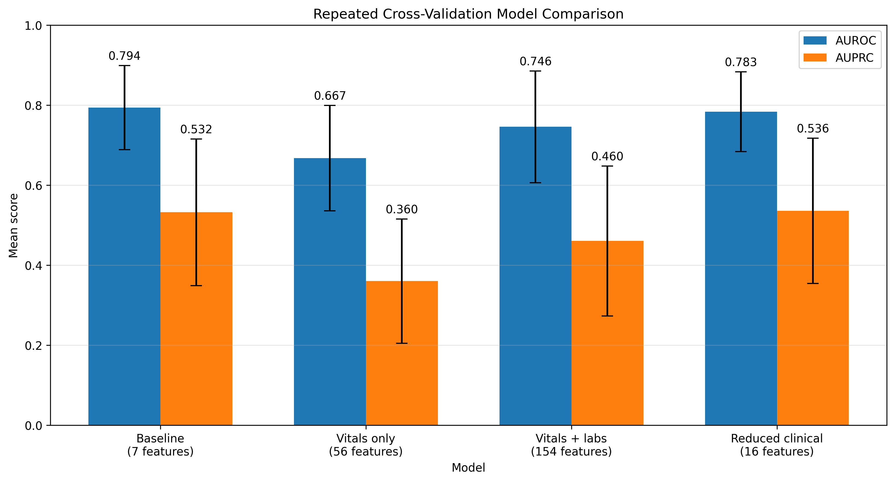
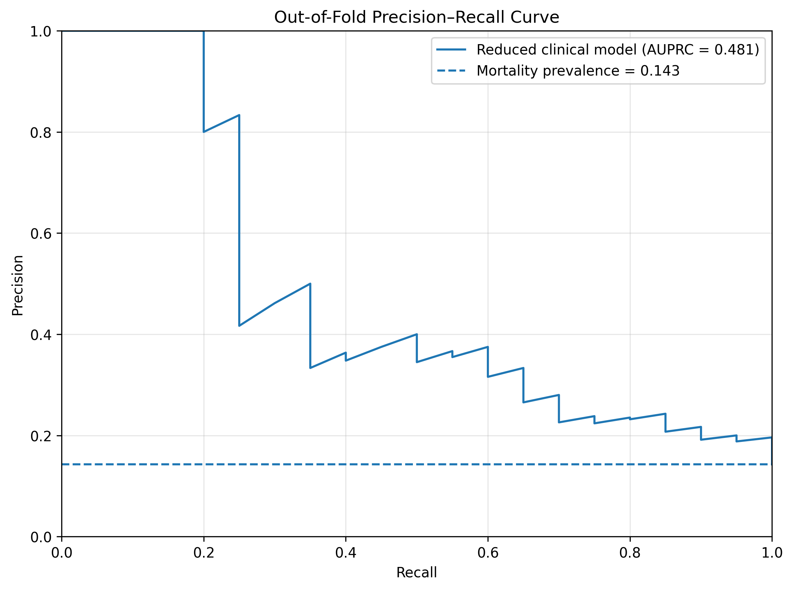
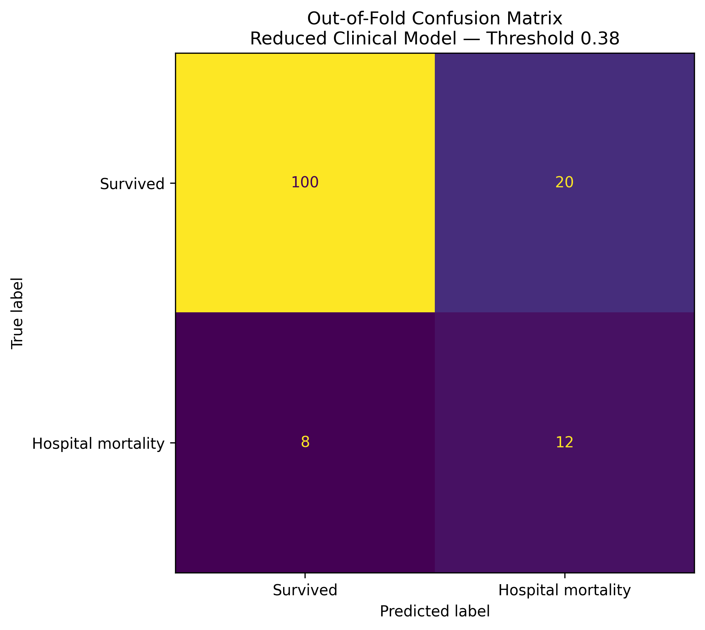

# ICU Hospital Mortality Risk Prediction

An end-to-end healthcare machine learning project that estimates hospital mortality risk using patient information and clinical measurements collected during the first 24 hours of an ICU stay.

This repository represents the completed MVP of a broader ICU deterioration-prediction project. The current model predicts **hospital mortality**, represented by `hospital_expire_flag`, rather than deterioration within a specific future 6-, 12-, or 24-hour window.

## Project Overview

The project uses the MIMIC-IV demo dataset to build and compare several XGBoost models:

* Admission-information baseline
* Vitals-only model
* Vitals-and-labs model
* Reduced clinical model
* Out-of-fold patient risk prediction
* Threshold tuning for mortality detection
* SHAP-based model explainability
* Streamlit dashboard for patient-level visualization

The final reduced clinical model uses a selected group of demographic, ICU, vital-sign, and laboratory features to reduce overfitting on the small demo dataset.

## Prediction Target

The target variable is:

```text
hospital_expire_flag
```

* `0` = patient survived the hospital admission
* `1` = patient died during the hospital admission

The model uses information collected during the first 24 hours after ICU admission.

## Dataset

This project uses the MIMIC-IV demo dataset.

The demo cohort contains approximately:

```text
100 patients
140 ICU stays
20 hospital mortality cases
```

Raw and processed clinical data are not included in this repository.

## Clinical Features

The reduced clinical model uses 16 selected features from the following categories:

### Patient and admission information

* Gender
* Age
* Admission type
* First ICU care unit

### First 24-hour vital signs

* Mean and maximum heart rate
* Mean respiratory rate
* Minimum oxygen saturation
* Minimum mean arterial pressure
* Maximum temperature

### First 24-hour laboratory results

* Maximum lactate
* Latest creatinine
* Latest blood urea nitrogen
* Maximum white blood cell count
* Minimum platelet count
* Minimum bicarbonate

## Project Workflow

```text
MIMIC-IV demo data
        |
        v
ICU cohort construction
        |
        v
First 24-hour vital feature extraction
        |
        v
First 24-hour laboratory feature extraction
        |
        v
XGBoost model training
        |
        v
Repeated cross-validation comparison
        |
        v
Reduced clinical feature selection
        |
        v
Out-of-fold predictions
        |
        v
Threshold tuning
        |
        v
SHAP explanations and Streamlit dashboard
```

## Model Comparison

Repeated five-fold cross-validation was used to compare the feature sets.

| Model                  | Features |  AUROC |  AUPRC | Recall |     F1 |
| ---------------------- | -------: | -----: | -----: | -----: | -----: |
| Admission baseline     |        7 | 0.7938 | 0.5322 |   0.50 | 0.4339 |
| Vitals only            |       56 | 0.6675 | 0.3601 |   0.12 | 0.1434 |
| Vitals and labs        |      154 | 0.7458 | 0.4603 |   0.24 | 0.2897 |
| Reduced clinical model |       16 | 0.7833 | 0.5357 |   0.39 | 0.3753 |

The reduced clinical model achieved the highest average AUPRC while using substantially fewer features than the complete vitals-and-labs model.

Its repeated cross-validation results were:

```text
AUROC: 0.7833 ± 0.0998
AUPRC: 0.5357 ± 0.1815
```

## Model Comparison Plot



## Out-of-Fold Evaluation

Five-fold out-of-fold predictions were generated so that every ICU stay received a prediction from a model that did not train on that stay.

```text
OOF AUROC: 0.7767
OOF AUPRC: 0.4809
```

At the default probability threshold of `0.50`, the model detected 7 of 20 mortality cases.

## Threshold Tuning

The decision threshold was tuned using the out-of-fold probabilities.

The selected threshold was:

```text
0.38
```

Performance at this threshold:

| Metric            | Result |
| ----------------- | -----: |
| Accuracy          |  0.800 |
| Balanced accuracy |  0.717 |
| Precision         |  0.375 |
| Recall            |  0.600 |
| Specificity       |  0.833 |
| F1-score          |  0.462 |
| True positives    |     12 |
| False negatives   |      8 |
| False positives   |     20 |
| True negatives    |    100 |

Lowering the threshold from `0.50` to `0.38` increased detected mortality cases from 7 to 12, with an increase in false-positive warnings.

## Out-of-Fold Evaluation Plots

### Precision–Recall Curve



The dashed horizontal line represents the mortality prevalence in the demo cohort. The reduced clinical model achieved an out-of-fold AUPRC of `0.4809`.

### Confusion Matrix at Threshold 0.38



At the selected threshold of `0.38`, the model correctly identified 12 of 20 mortality cases, with 20 false-positive warnings.

## Risk Categories

The Streamlit dashboard uses the following exploratory categories:

```text
Risk below 0.21       → Low Risk
Risk from 0.21–0.38   → Medium Risk
Risk of 0.38 or above → High Risk
```

These categories are intended only for demonstration and have not been clinically validated.

## Explainability

SHAP is used to explain how individual features influence the XGBoost model prediction.

* Positive SHAP values push the model prediction toward higher mortality risk.
* Negative SHAP values push the model prediction toward lower mortality risk.
* SHAP values explain model behavior and do not establish clinical causation.

## Streamlit Dashboard

The dashboard displays:

* Out-of-fold mortality risk
* Risk category
* Actual hospital outcome
* Final-model risk
* Patient and ICU information
* First 24-hour vitals
* First 24-hour laboratory results
* Risk-increasing SHAP features
* Risk-decreasing SHAP features
* Clinical research disclaimer

The out-of-fold risk is used as the primary evaluation score because the corresponding ICU stay was excluded from the model's training fold.

## Repository Structure

```text
ICU-Deterioration-Prediction/
│
├── app/
│   └── streamlit_app.py
│
├── src/
│   ├── 01_data_check.py
│   ├── 02_baseline_xgboost.py
│   ├── 03_extract_vitals_features.py
│   ├── 04_train_xgboost_vitals.py
│   ├── 05_threshold_tuning.py
│   ├── 06_shap_explainability.py
│   ├── 07_extract_lab_features.py
│   ├── 08_train_xgboost_vitals_labs.py
│   ├── 09_compare_models_cv.py
│   ├── 10_train_reduced_clinical_model.py
│   ├── 11_generate_oof_predictions.py
│   └── 12_tune_oof_threshold.py
│
├── README.md
└── requirements.txt
```

## Installation

Clone the repository:

```bash
git clone https://github.com/pratiks1234/ICU-Deterioration-Prediction.git
cd ICU-Deterioration-Prediction
```

Install the required Python packages:

```bash
pip install -r requirements.txt
```

## Running the Pipeline

The scripts in `src/` are numbered according to their execution order.

After downloading and placing the required MIMIC-IV demo files in the expected local data folders, run:

```bash
python src/01_data_check.py
python src/02_baseline_xgboost.py
python src/03_extract_vitals_features.py
python src/04_train_xgboost_vitals.py
python src/05_threshold_tuning.py
python src/06_shap_explainability.py
python src/07_extract_lab_features.py
python src/08_train_xgboost_vitals_labs.py
python src/09_compare_models_cv.py
python src/10_train_reduced_clinical_model.py
python src/11_generate_oof_predictions.py
python src/12_tune_oof_threshold.py
```

Run the dashboard:

```bash
streamlit run app/streamlit_app.py
```

## Limitations

* The MIMIC-IV demo dataset is extremely small.
* The cohort contains only about 20 mortality cases.
* Model performance varies substantially between validation folds.
* The current target is hospital mortality, not deterioration within a future prediction window.
* Cross-validation currently operates at the ICU-stay level rather than grouping all stays from the same patient.
* The decision threshold was selected using exploratory out-of-fold predictions.
* The model has not been externally validated.
* Some variables may reflect clinical workflow and measurement frequency rather than only patient physiology.
* SHAP explanations are not causal clinical explanations.
* The dashboard is not intended for real-world medical decision-making.

## Future Work

Planned improvements include:

* Patient-grouped cross-validation using `subject_id`
* Training on the full credentialed MIMIC-IV dataset
* Defining true 6-, 12-, and 24-hour deterioration outcomes
* Adding time-series models such as LSTM and GRU
* Probability calibration
* Fairness evaluation
* External validation
* Deployment with reproducible model artifacts

## Intended Use

This project is intended for:

* Machine learning education
* Healthcare data-science research
* Portfolio demonstration
* Explainable-AI experimentation

It is not intended for diagnosis, treatment, patient monitoring, or clinical decision support.

## Data Privacy

Raw MIMIC-IV data, processed patient-level datasets, identifiers, trained model files, and patient prediction files are not included in this public repository.

Users must obtain authorized dataset access separately and follow the applicable data-use requirements.

## Disclaimer

This project is a research and educational demonstration only. It is not a medical device and must not be used for clinical care.
